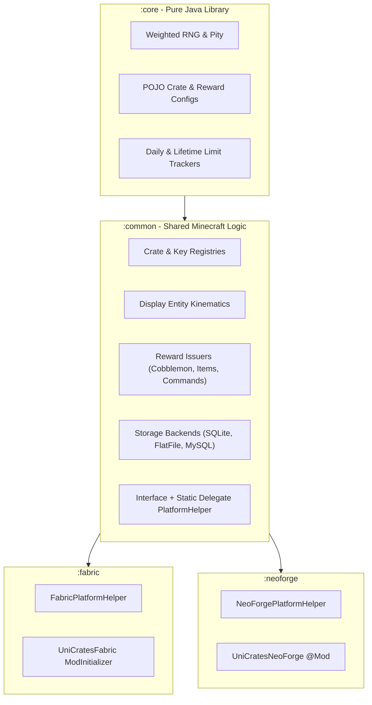

# Developer & Platform Architecture

UniCrates is engineered strictly under a decoupled multi-module multi-loader paradigm.

---

## 1. Modular Architecture



### Module Roles
- **`:core`**: Zero Minecraft dependencies. Contains pure domain logic, probability math, easing equations, and JSON serialization models. 100% testable via JUnit 5.
- **`:common`**: Shared Minecraft systems using vanilla registries, `CustomPacketPayload`, and the Interface + Static Delegate pattern (`Services.PLATFORM`).
- **`:fabric` & `:neoforge`**: Lightweight entrypoints and platform-specific network/menu registrations.

---

## 2. Registering Custom Reward Issuers

You can register custom reward issuers into the `RewardDispatcher` to handle proprietary server currencies, external battle passes, or custom plugins:

```java
import com.unicrates.reward.RewardIssuer;
import com.unicrates.reward.RewardContext;
import com.unicrates.core.reward.RewardConfig;

public class CustomPassXpIssuer implements RewardIssuer {
    @Override
    public boolean issue(RewardContext ctx, RewardConfig reward) {
        int xp = reward.customData != null ? reward.customData.optInt("xp", 100) : 100;
        // Grant battle pass XP to ctx.player()
        return true;
    }
}
```

---

## 3. Storage Layer & Concurrency

- **FlatFile**: JSON documents saved per player UUID in `data/players/`.
- **SQLite**: Local relational database with auto-created tables and indexing in `data/unicrates.db`.
- **MySQL / MariaDB**: Connection pool using HikariCP for high-traffic multi-server networks.
- **Thread Safety**: All I/O operations execute asynchronously off the server tick thread, scheduling inventory mutations back onto `server.execute()` to prevent main-thread lag.
